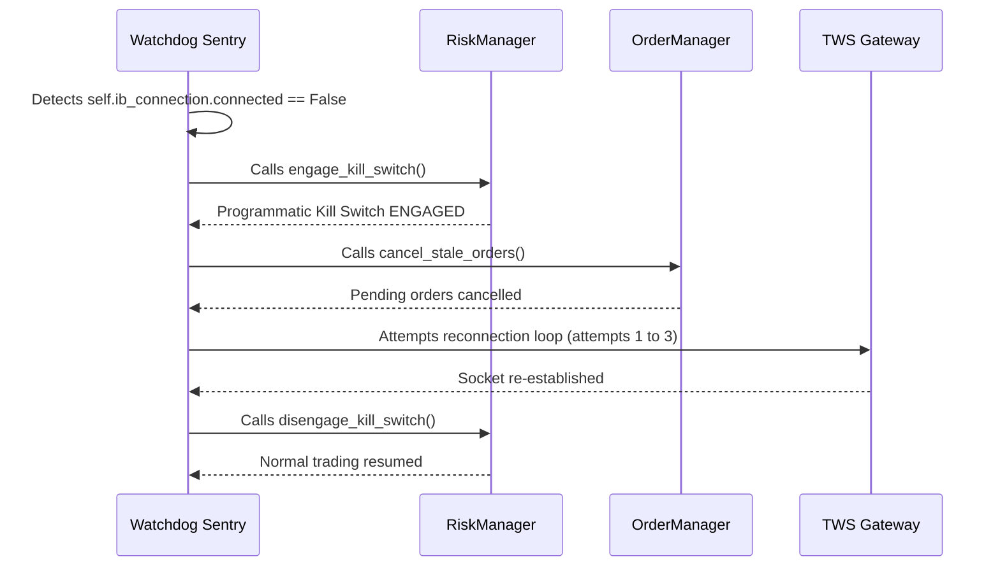

# Disaster Recovery & System Failover Playbook

This document details the recovery plans and step-by-step procedures for restoring normal operations during systemic, broker, or infrastructural failures.

---

## 1. Broker Socket Disconnection
### Symptoms
- Watchdog logs print: `[Watchdog Sentry] Broker disconnection detected! Engaging emergency safeties...`
- Centralized health checks report `connected: False` in `trading_health.json`.
- TWS/Gateway socket drops or shuts down.

### Auto-Healing Path


### Manual Recovery Steps
If auto-healing attempts are exhausted and the system remains in **LOCKDOWN** mode:
1. Log into the server hosting the IB Gateway or TWS.
2. Verify Gateway/TWS is running and authenticated. If frozen, force close and restart the Gateway.
3. Verify the API port is enabled and matches the environment configuration (`7496` for live, `7497` for paper).
4. Force restart the trading engine to re-bind the client socket:
   ```powershell
   python trading_launcher.py
   ```

---

## 2. Server Crash / Host Reboot
### Symptoms
- Trading dashboard unresponsive.
- Process PID missing from `.trading_engine.pid`.
- Missing log activity.

### Recovery Steps
1. **Verification:** Inspect if the system rebooted or the process was killed by OOM (Out Of Memory) killer:
   ```powershell
   Get-Content trading_logs.txt -Tail 50
   ```
2. **State Cache Audit:** Inspect `.state_cache.json` and verify it contains the correct position, stop-loss, and daily P&L boundaries. If corrupted, restore the previous hourly backup or reconstruct the JSON:
   ```json
   {
     "daily_loss": 0.0,
     "open_positions": {},
     "stop_loss_prices": {},
     "take_profit_prices": {}
   }
   ```
3. **Execution Restore:** Relaunch the engine daemon. The `StateManager` will automatically rehydrate the active stop-losses and positions upon launch, preserving risk limits.
   ```powershell
   python trading_launcher.py
   ```

---

## 3. Position Out-of-Sync / Reconciliation Mismatch
### Symptoms
- Real positions in TWS do not match the local positions in `.state_cache.json` or `daily_positions.json`.

### Immediate Actions
1. **Freeze Execution:** Instantly engage the programmatic Kill Switch to prevent new orders:
   ```python
   from risk_manager import RiskManager
   from ib_connection import InteractiveBrokersConnection
   rm = RiskManager(InteractiveBrokersConnection())
   rm.engage_kill_switch()
   ```
2. **Sync Script Execution:** Run the position reconciliation script to force sync local files with TWS real positions:
   ```powershell
   python -c "import daily_positions, ib_connection; conn = ib_connection.InteractiveBrokersConnection(); conn.connect(); positions = conn.get_positions(); daily_positions.sync_from_ib_positions(positions); print('Position Sync Complete')"
   ```
3. **Disengage Kill Switch:** After manual audit confirms alignment, disengage the Kill Switch.

---

## 4. Host Internet / Network Drop
### Symptoms
- Latency metrics spike $> 2000\text{ms}$.
- Data fetchers report `urllib.error.URLError` or yfinance timeouts.

### Recovery Steps
1. The **Watchdog Sentry** will automatically block trading signals when connection is lost.
2. If internet connection is lost for more than 15 minutes, log in to the host, check network configurations, or switch to the secondary fallback backup ISP link.
3. Check the execution logs to confirm if any orders were pending or partially filled during the disconnect, and reconcile them manually in TWS.
