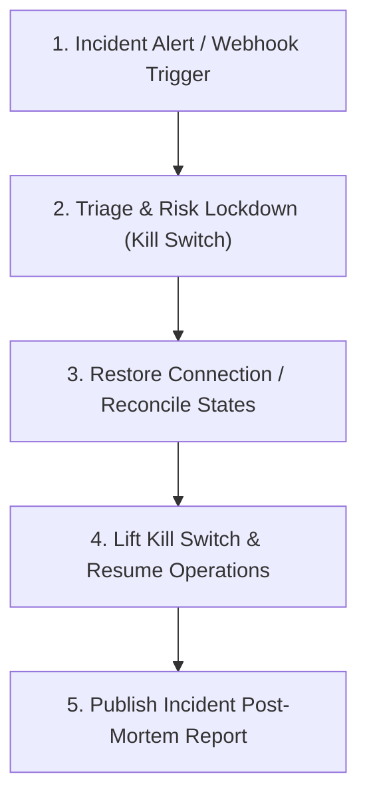

# Institutional Incident Response Playbook

This document details the emergency response protocols, manual override procedures, and triage steps for active production incidents.

---

## 1. QUICK-TRIAGE REFERENCE

| Incident Scenario | Severity | Immediate Action | Command / Triage Step |
| :--- | :--- | :--- | :--- |
| **Market Volatility Spike / Panic** | **CRITICAL** | Engage Kill Switch (Block new entries) | Execute python emergency lock script |
| **Positions Out of Sync / Mismatch** | **HIGH** | Run Position Reconciliation | Compare TWS count vs `daily_positions.json` |
| **Lingering / Duplicate Fills** | **HIGH** | Cancel Pending + Flat Position | Submit manual exit limit order in TWS |
| **Execution Loop / Socket Drop** | **MEDIUM** | Let Watchdog Recover | Check logs for auto-reconnection progress |

---

## 2. EMERGENCY OVERRIDE & FLATTEN PROTOCOLS

### Protocol A: Programmatic Kill Switch Engagement
If the platform experiences weird behavior or an unhedged position arises, instantly engage the Kill Switch:
```powershell
.venv\Scripts\python.exe -c "import ib_connection, risk_manager; conn = ib_connection.InteractiveBrokersConnection(); conn.connect(); rm = risk_manager.RiskManager(conn); rm.engage_kill_switch(); print('Kill Switch engaged')"
```

### Protocol B: Emergency Flatten-All Positions
To liquidate all active open positions instantly under extreme panic or wrong routing:
1. Double-check market hours and liquidity depth.
2. Execute the emergency flatten script (places immediate opposite-side limit orders, defaulting to market orders on failure):
   ```powershell
   .venv\Scripts\python.exe -c "import ib_connection, risk_manager, core.order_manager; conn = ib_connection.InteractiveBrokersConnection(); conn.connect(); rm = risk_manager.RiskManager(conn); oms = core.order_manager.OrderManager(conn); rm.emergency_flatten_all(order_manager=oms)"
   ```
3. Audit the TWS dashboard to verify `0` open positions remain.

---

## 3. WRONG DATA / FEED ANOMALIES

### Symptoms
- Stock screener selects highly volatile shell companies or pricing outliers.
- MomentumStrategy issues BUY orders based on abnormal 100% price gains (data feed error).

### Action Checklist
1. **Engage Kill Switch** immediately to block order routing.
2. **Inspect DataFetcher Logs:** Verify yfinance downloads aren't corrupted or split-adjusted:
   ```powershell
   Get-Content trading_logs.txt -Tail 100 | Select-String "DataFetcher"
   ```
3. **Blacklist Symbol:** Temporarily add the anomalous symbol to `EXCLUDED_EVENT_SENSITIVE_STOCKS` in `config.py` to prevent screener candidates.

---

## 4. INCIDENT TRIAGE & POST-MORTEM WORKFLOW



### Post-Mortem Guidelines
For every severity HIGH or CRITICAL incident, the on-duty quant engineer must compile an Incident Report detailing:
- **Incident Timeline:** Millisecond timestamps of the root cause, alert, triage actions, and resolution.
- **Root Cause Analysis (RCA):** Detailed explanation of the architectural or market-regime trigger.
- **Capital Impact:** Total slippage, loss, or unhedged exposure.
- **Preventative Measures:** Steps taken to patch tests or configuration to prevent recurrence.
