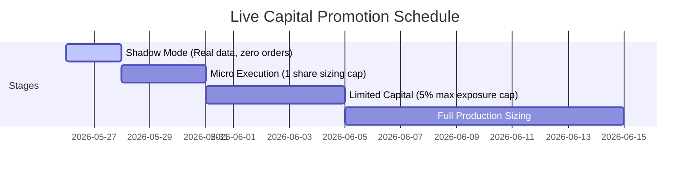

# Institutional Live Trading Promotion Checklist

This document details the mandatory pre-flight checklist that must be satisfied and signed off before transitioning the automated trading platform from paper trading to live-capital execution.

---

## 1. Automated Testing & Compliance Gates
* [ ] **100% Green Test Suite:** All 74 hermetic tests must pass with zero exceptions.
  ```powershell
  .venv\Scripts\python.exe -m pytest
  ```
* [ ] **Finalization Suite Verified:** Watchdog, Approval Gate, and environment binding tests pass.
  ```powershell
  .venv\Scripts\python.exe -m pytest test_production_finalization.py
  ```
* [ ] **Live Approval Gate Checked:** Run the Live Approval Gate solver and verify a `Deployment Readiness Score` $\ge 90\%$.
  ```python
  from core.approval_gate import LiveApprovalGate
  print(LiveApprovalGate().evaluate_readiness())
  ```

---

## 2. Infrastructure & Environment Readiness
* [ ] **Host Connectivity:** Ensure reliable low-latency ping to the IB Gateway or TWS host ($< 5\text{ms}$ on localhost, $< 50\text{ms}$ on remote hosts).
* [ ] **Production Port Verification:** Verify that TWS/Gateway is configured for the live port `7496` (and NOT the paper port `7497`).
* [ ] **Credentials Configuration:** Validate that `.env` files are fully populated and loaded:
  ```env
  IB_HOST=127.0.0.1
  IB_PORT=7496
  IB_CLIENTID=1
  IB_ACCOUNT=DU1234567  # Replace with actual live account ID
  PAPER_TRADING=False
  ENABLE_LIVE_TRADING=True
  ```
* [ ] **Docker Orchestration Mounts:** Ensure Docker volumes for persistence are mapped correctly to survive host restarts.

---

## 3. Risk & Safety Gate Settings
* [ ] **Shadow Mode Promotion:** Verify that the platform safety gate is initialized in `TradingStage.SHADOW` for the first 48 hours of market hours.
* [ ] **Programmatic Kill Switch Disengaged:** Confirm that `RiskManager.kill_switch_active` is `False` and the Connection Watchdog Sentry is active.
* [ ] **Exposure Percent Limit:** Set `MAX_PORTFOLIO_POSITION_PERCENT` to a conservative `0.02` (2% of account equity per trade) for initial live promotion.
* [ ] **Daily Loss Boundary:** Set `MAX_DAILY_LOSS` to a strict cap (e.g. 1% of net account liquidation value).

---

## 4. Staged Promotion Timeline



### Stage 1: Shadow Mode (Min. 2 Days)
- **Settings:** `PAPER_TRADING=False`, `ENABLE_LIVE_TRADING=False`, `TradingStage.SHADOW`
- **Goal:** Verify that signals are generated, tax implications are evaluated, and order logs match market pricing perfectly without placing real trades.

### Stage 2: Micro Sizing (Min. 3 Days)
- **Settings:** `TradingStage.MICRO` (Capped at exactly 1 share per trade).
- **Goal:** Verify that order routing, live fills, and EWrapper callback handling perform deterministically with real TWS accounts.

### Stage 3: Limited Capital (Min. 5 Days)
- **Settings:** `TradingStage.LIMITED` (Capped at 5% portfolio exposure).
- **Goal:** Verify execution slippage metrics and portfolio correlation limits under real market conditions.

### Stage 4: Full Production
- **Settings:** `TradingStage.FULL`
- **Goal:** Normal execution within limits defined in `RISK_LIMITS.md`.
